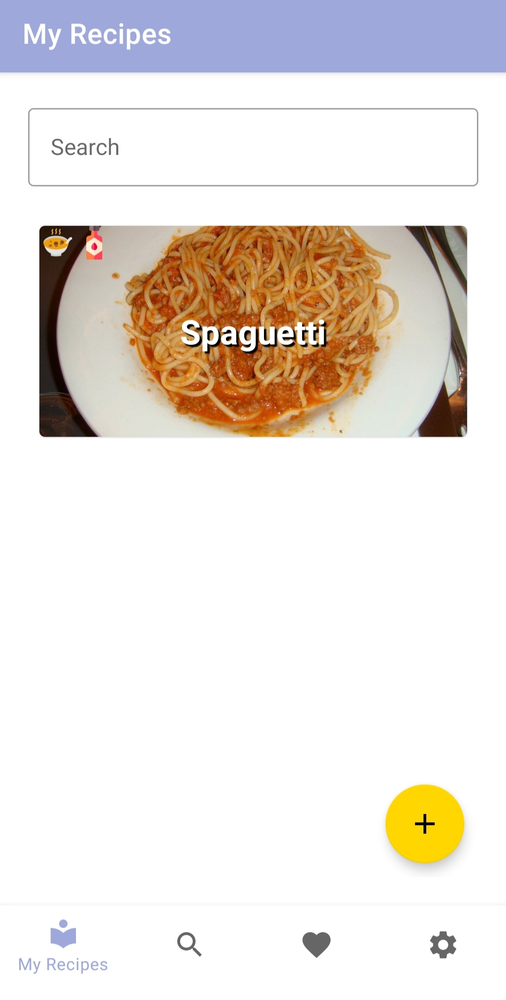
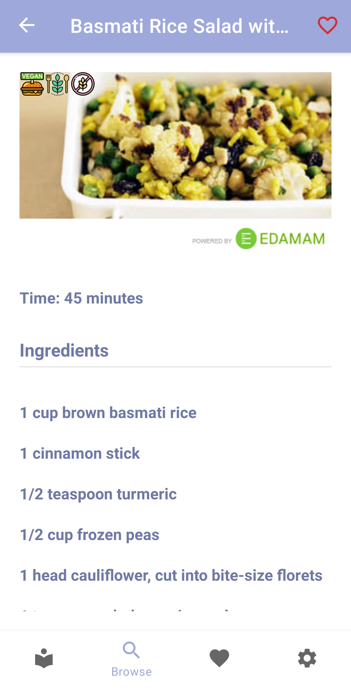
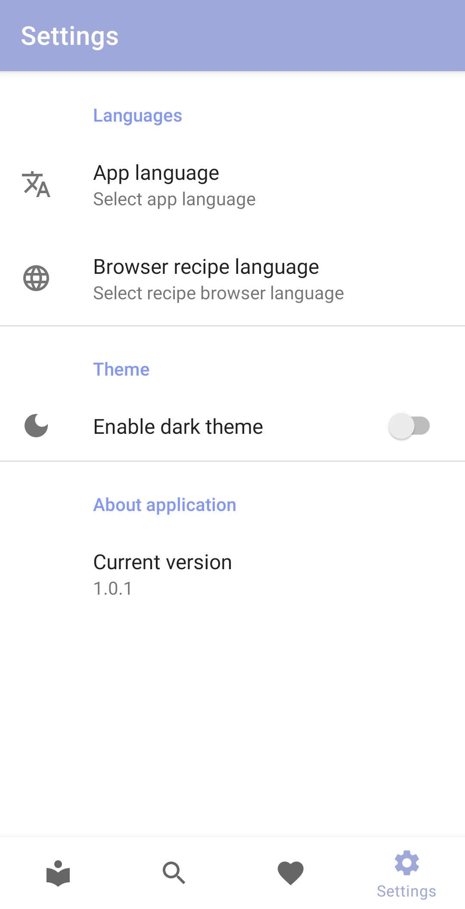

<br>
<p align="center">
  <a href="https://github.com/EasyRecipe/Easy-Recipe" target="_blank">
    
  </a>
</p>

<h1 align="center">Easy Recipe</h1>

<p align="center">
  <a href="https://www.android.com" target="__blank"></a>
  <a href="https://docs.gradle.org/current/release-notes" target="__blank"></a>
  <a href="https://sonarcloud.io/dashboard?id=Appaxer_EasyRecipe"></a>
</p>

<p align="center">
  <a href="https://www.edamam.com" title="Powered by Edamam" target="_blank">
    
  </a>
</p>

This is an Android app where you can store all your recipes and take them with you anywhere. It also allows you to search for hundreds of recipes thanks to [Edamam's Recipe API](https://developer.edamam.com/edamam-docs-recipe-api).

## Building
### Edamam API key
You need to add the following lines to your `local.properties` file:
```gradle
edamam.appId=YOUR_EDAMAM_APP_ID
edamam.apiKey=YOUR_EDAMAM_APP_KEY
```

### Firebase
You need to set up a firebase project and add the *google-services.json* file to the *app* folder. You should enable at least the following services:
- Authentication: email/password and google sign in
- Firestore Database

## Download the app

<p align="center">
  <a href="https://github.com/EasyRecipe/Easy-Recipe/releases/latest/download/easy-recipe.apk">
    
  </a>
</p>

## Screenshots
<table style="width:100%">
  <tr>
    <th>Local recipe</th>
    <th>Remote recipe</th>
  </tr>
  <tr>
    <td></td>
    <td></td>
  </tr>
  <tr>
    <th>Settings</th>
  </tr>
  <tr>
    <td></td>
  </tr>
</table>

## Documentation
To see the documentation visit the [Wiki](https://github.com/EasyRecipe/Easy-Recipe/wiki)

## Contributing
To contribute with the project, please have a look at the [code of conduct](CODE_OF_CONDUCT.md) and the [contributing](CONTRIBUTING.md) files.

## Attributions
This application uses icons made by:

- [Smashicons](https://smashicons.com/ "Smashicons") from [www.flaticon.com](https://www.flaticon.com/ "Flaticon")
- [Freepik](https://www.freepik.com "Freepik") from [www.flaticon.com](https://www.flaticon.com/ "Flaticon")
- [photo3idea_studio](https://www.flaticon.com/authors/photo3idea-studio "photo3idea_studio") from [www.flaticon.com](https://www.flaticon.com/ "Flaticon")
- [Flat Icons](https://www.flaticon.com/authors/flat-icons "Flat Icons") from [www.flaticon.com](https://www.flaticon.com/ "Flaticon")
- [monkik](https://www.flaticon.com/authors/monkik "monkik") from [www.flaticon.com](https://www.flaticon.com/ "Flaticon")
- [Smashicons](https://www.flaticon.com/authors/smashicons "Smashicons") from [www.flaticon.com](https://www.flaticon.com/ "Flaticon")
- [Becris](https://www.flaticon.com/authors/becris "Becris") from [www.flaticon.com](https://www.flaticon.com/ "Flaticon")
- [Nhor Phai](https://www.flaticon.com/authors/nhor-phai "Nhor Phai") from [www.flaticon.com](https://www.flaticon.com/ "Flaticon")

## License
Easy Recipe is licensed under GPL. See the [LICENSE](LICENSE) file.
